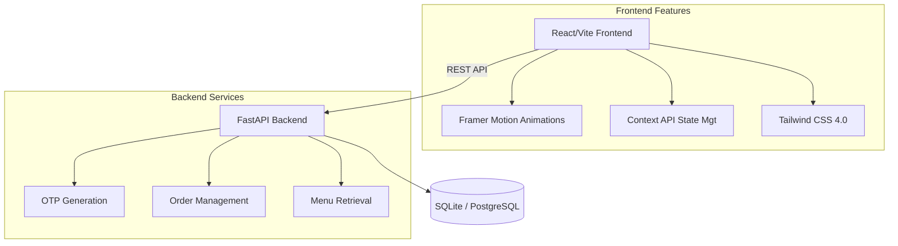
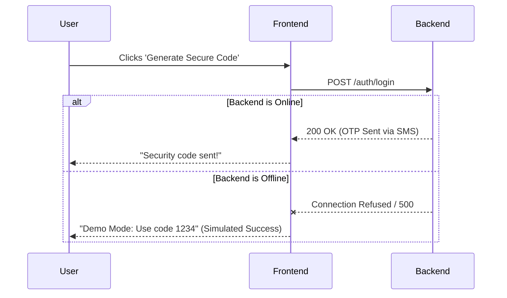

# 🍕 SliceMind: Project Showcase & Documentation

## 🌟 The Vision
**SliceMind** is not just another pizza ordering application. It is a proof-of-concept for the future of food delivery. Built with an "AI-first" philosophy, SliceMind aims to eliminate decision fatigue by learning user taste profiles and predicting their cravings before they even open the app. 

The aesthetic is aggressively modern: deep dark modes, glowing neon accents, and fluid micro-interactions designed to make the user feel like they are interacting with an advanced AI terminal.

---

## 🏗️ Architecture Overview

SliceMind is a modern, decoupled full-stack application.

- **The Brain (Backend):** A high-performance Python FastAPI server connected to a persistent SQLite/PostgreSQL database. It handles secure OTP validation, order processing, and dynamic menu retrieval.
- **The Interface (Frontend):** A lightning-fast React application built on Vite, leveraging Tailwind CSS for atomic styling and Framer Motion for buttery-smooth state transitions.

### System Architecture Diagram

### The "Demo Mode" Fallback Flow
Because the frontend is designed to be highly resilient, it implements a silent fallback mechanism when the backend is unreachable.

---

## 🚀 Core Feature Breakdown

### 1. Passwordless Authentication (The Login Terminal)
- **Concept:** Passwords are a thing of the past. Users authenticate using their mobile numbers.
- **UX Details:** The login screen features a frosted glassmorphism card over a floating background of animated pizza emojis.
- **Native Integration:** We utilize `autoComplete="one-time-code"` and `inputMode="numeric"` to ensure that iOS and Android devices can automatically parse and suggest incoming SMS OTPs directly above the keyboard.

### 2. Intelligent Dashboard (The Home Screen)
- **Live Geolocation:** The app automatically requests browser Geolocation permissions, passing the exact coordinates to the OpenStreetMap Reverse Geocoding API to dynamically display the user's current city and neighborhood.
- **Predictive Layout:** The UI prioritizes actions based on the user's state—prompting them to resume an active order, chat with the AI, or browse the personalized menu.

### 3. The Neural Menu & Cart
- **Dynamic Filtering:** Users can toggle between Veg and Non-Veg with fluid layout animations.
- **Frictionless Cart:** A slide-out drawer that calculates subtotal, GST, and delivery fees in real-time. 
- **Bulk Mode:** An interactive toggle that instantly multiplies all item quantities by 10x for party planning.

### 4. Live Drone Tracking (Active Orders)
- **Concept:** Reimagining the "Order Status" page.
- **UX Details:** Instead of a boring list, users see an animated radar UI. A glowing green blip simulates an approaching delivery drone. A beautifully styled gradient progress bar updates as the order moves from "Confirmed" to "Delivered".

### 5. Receipt Vault (Taste History)
- **Concept:** A nostalgic yet modern take on past orders.
- **UX Details:** Past orders are rendered as highly polished, glassmorphic "receipt" cards featuring a classic dashed tear-line.
- **1-Tap Reorder:** A prominent action button allows users to instantly dump an entire past order back into their cart with a single tap.

### 6. The AI Sommelier (Chat Interface)
- **Concept:** An embedded chat interface where users can converse with the SliceMind AI.
- **Capabilities:** The bot is designed to answer questions about menu items, recommend pairings based on the user's historical taste profile, and provide status updates on active drone deliveries.

---

## 🛠️ Deep Dive: Technology Stack

### Frontend Ecosystem
| Technology | Purpose | Why We Chose It |
| :--- | :--- | :--- |
| **React 19** | UI Library | Component-based architecture for maximum reusability. |
| **Vite** | Build Tool | Blazing fast Hot Module Replacement (HMR) and optimized production builds. |
| **Tailwind CSS 4.0** | Styling | Utility-first CSS allows us to build complex, responsive layouts directly in JSX without context-switching. |
| **Framer Motion** | Animation | Provides physics-based, declarative animations that feel incredibly natural (e.g., spring physics on hover states). |
| **React Router v7** | Navigation | Client-side routing for instantaneous, SPA (Single Page Application) page transitions. |
| **React Hot Toast** | Notifications | Lightweight, highly customizable, and animated toast notifications for user feedback. |

### Backend Ecosystem
| Technology | Purpose | Why We Chose It |
| :--- | :--- | :--- |
| **Python 3.11+** | Core Language | Robust, readable, and perfectly suited for integrating future Machine Learning pipelines. |
| **FastAPI** | API Framework | Asynchronous, auto-documenting (Swagger UI), and incredibly fast compared to traditional Flask/Django setups. |
| **Uvicorn** | ASGI Server | High-performance asynchronous server to run the FastAPI application. |
| **SQLite / PostgreSQL** | Database | SQLite is used for zero-config local development (`pizza.db`), easily scalable to PostgreSQL for cloud deployment via Supabase. |

---

## 🛡️ Reliability & Offline Fallbacks (Demo Mode)

One of SliceMind's most powerful technical achievements is its **Zero-Downtime Demo Mode**. 

If the frontend ever detects that the FastAPI backend is offline, unreachable, or throwing a 500 error, it gracefully falls back to a simulated local environment:
- **Mock Auth:** Intercepts the API failure and automatically approves the login if the user enters the master code `1234`.
- **Mock Checkout:** Intercepts cart submission failures and injects a simulated "Success" response, generating a local Order ID and routing the user to the tracking screen.
- **Mock AI:** The chatbot will intercept network failures and respond with a randomized array of realistic AI responses (e.g., *"Based on your profile, I recommend the Triple Pepperoni!"*).

This ensures the application remains **100% presentable and testable** at all times, regardless of server health.

---

## 🔮 Future Roadmap (V2.0)
1. **Live Stripe Integration:** Replacing the simulated "Confirm & Pay" with actual Stripe Checkout sessions.
2. **True LLM Integration:** Upgrading the Chatbot from rule-based/mock responses to an OpenAI API integration, complete with function-calling to allow the AI to physically add items to the user's cart.
3. **Push Notifications:** Integrating Firebase Cloud Messaging (FCM) to ping the user's phone when the "Drone" is arriving.
